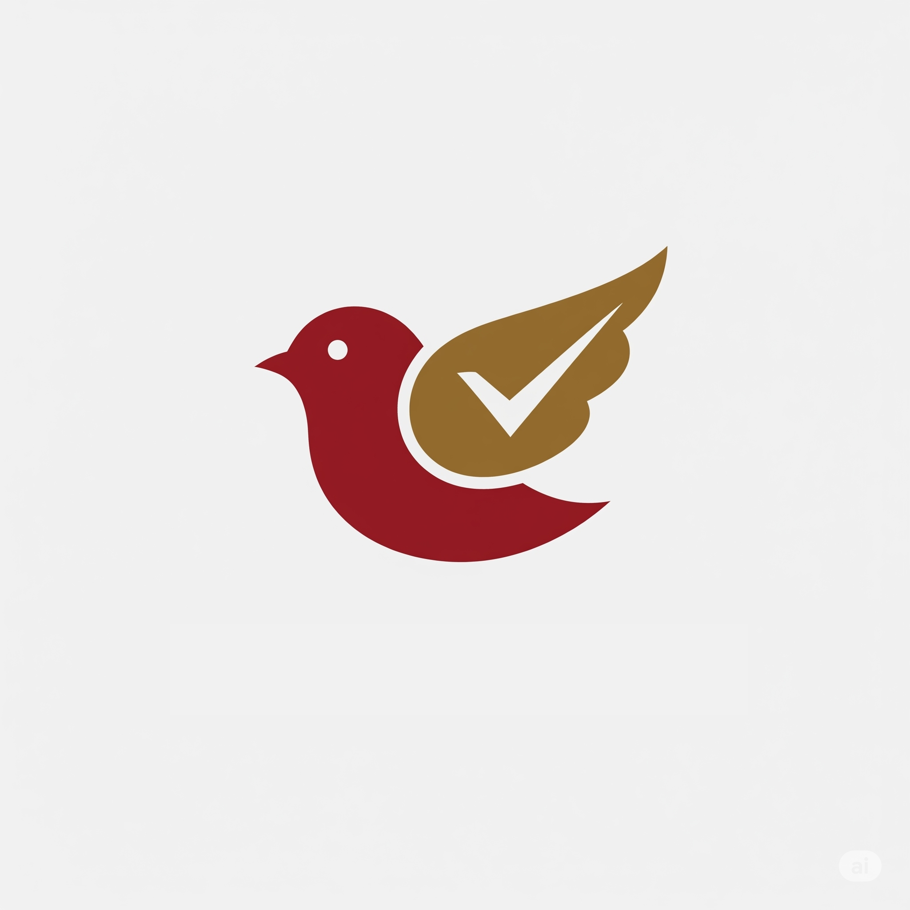

# 🚀 Bicudinho's To Do
> Projeto da disciplina de [Programação Web e Mobile](https://github.com/Dudubraga/unicap-cc-programacao-web-e-mobile)

## 📖 Visão Geral

App para nosso grupo da faculdade organizar o que cada um deve fazer nos projetos acadêmicos.

- **Instituição:** UNICAP
- **Professor:** Marcio Bueno
- **Período:** 2025.1

## ✨ Funcionalidades

- Criação, edição e remoção de projetos e atividades.
- Associar membros a certas atividades de projetos.
- Telas individuais de cada membro com todas as suas atividades.

## 🛠️ Tecnologias Utilizadas

- React Native
- TypeScript
- Expo
  
## 📦 Download do APK

Baixe o APK mais recente [aqui](https://github.com/Dudubraga/unicap-cc-proj-bicudinhos-to-do/releases).

## 👨‍💻 Equipe

| Nome              | GitHub                               |
| ----------------- | ------------------------------------ |
| Eduardo Braga     | [@Dudubraga](https://github.com/Dudubraga) |
| Henrique Franca   | [@HenriqueFrancaa](https://github.com/HenriqueFrancaa) |
| Isabela Medeiros  | [@belamedeirosbl](https://github.com/belamedeirosbl) |
| Júlia Galvão      | [@juliaavilelaa](https://github.com/juliaavilelaa) |
| Rafael Angelim    | [@RafaelAngelim](https://github.com/RafaelAngelim) |
